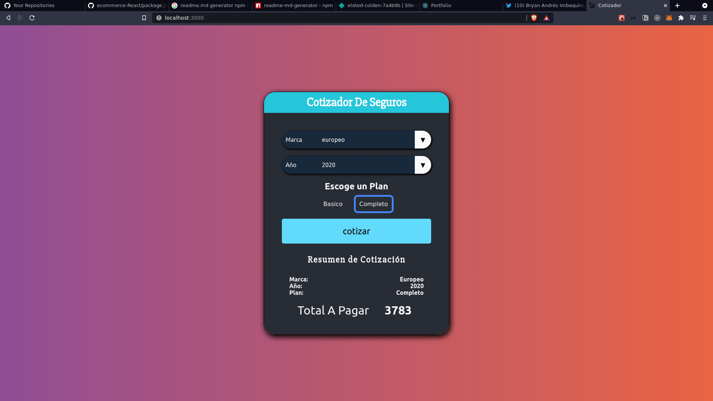

<h1 align="center">Welcome to cotizador 👋</h1>
<p>
  
  <a href="https://twitter.com/bryandresimba" target="_blank">
    
  </a>
    
</p>

> cotizador de seguros de vehículos

## Install

```sh
npm install
```

## Author

👤 **Bryan Imbaquingo**

- Website: https://elated-colden-7a4b9b.netlify.app/
- Twitter: [@bryandresimba](https://twitter.com/bryandresimba)
- Github: [@bimbaquingoch](https://github.com/bimbaquingoch)

## Show your support

Give a ⭐️ if this project helped you!

---

_This README was generated with ❤️ by [readme-md-generator](https://github.com/kefranabg/readme-md-generator)_

